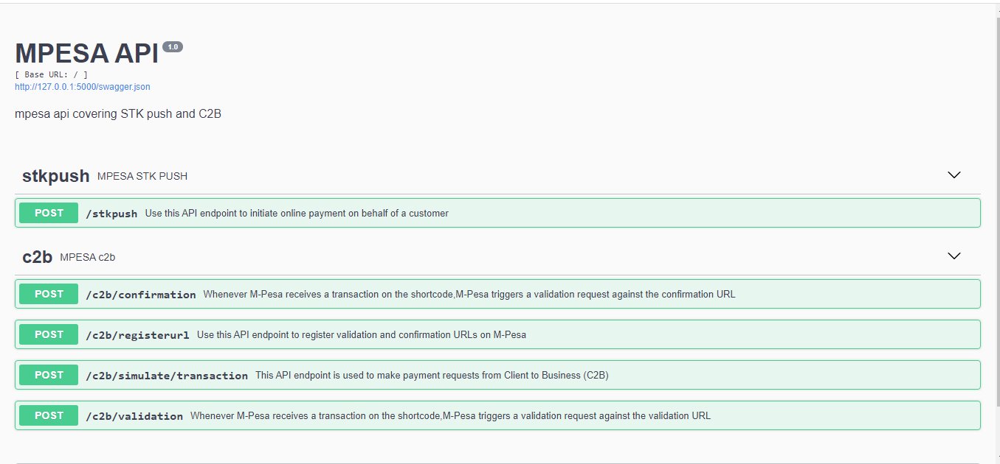

# mpesa_apis

An API created (using flask rest-plus) to consume the safaricom daraja APIs and includes STK push, C2B

## Installation

1.Clone Repo

```
https://github.com/KivutiBrian/mpesa_apis.git
```

2.Create Virtual Environment folder

```
python -m venv env
```


3.Activate virtual environment in parent directory of your "env"

For Linux systems and MAC

```
source env/bin/avtivate
```

For Windows

```
env\Scripts\activate.bat
```

4.Install requierements
```
pip install - r requirements.txt
```

5.Before you can run the application successfully, navigate to the constants.py file and fill in your test credentials,

```
consumer_keyy = ''
consumer_secrett = ''

BusinessShortCode = '' #should be the lipa na mpesa online shortcode provide on test credentials
LipaNaMpesaPassKey = ''

shortcode = "" #shortcode 1

# the urls to be used in the c2b register urls
validationUrl = ''
confirmationUrl = ''


```
After updating the code above, to run the code

For windows
```
cd app
set FLASK_APP=main.py
flask run
```

For Linux systems and MAC
```
cd app
export FLASK_APP=main.py
flask run
```

# ENDPOINTS


